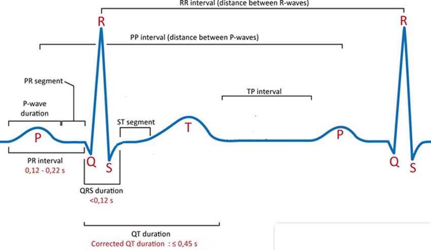

# [Artificial Neural Network Simplified with 1-D ECG BioMedical Data](https://www.analyticsvidhya.com/blog/2021/07/artificial-neural-network-simplified-with-1-d-ecg-biomedical-data/)

## Introduction

The application of Machine Learning (ML) and Deep Learning (DL) in biomedical signal processing is an exciting field, enabling automated analysis and health monitoring. Particularly, ECG (electrocardiogram) signals provide vital insights into the functioning of the human heart, using physiological sensors and ML approaches.


***

## Biomedical Signals \& Human Body Data

The human body is a natural machine capable of providing numerous physiological signals useful for health monitoring.

### Common Bio-Signals

- Electrocardiogram (ECG) – Heart
- Electromyography (EMG) – Skeletal muscles
- Electroencephalography (EEG) – Brain
- Electrooculography (EOG) – Eye
- Electroretinography (ERG) – Retina
- Electrogastrogram (EGG) – Stomach
- Phonocardiogram – Heart sounds/murmurs
- Photoplethysmography (PPG) – Blood volume changes

***

## Data Dimensionality

Understanding dimensions is foundational for handling biomedical and ANN data.

- **0-D**: Point (no dimension)
- **1-D**: Line (length)
- **2-D**: Square (length, width)
- **3-D**: Cube (length, width, height)
- **4-D**: Space-time (adds time as a dimension)


### Fourth Dimension and Space-Time

When an object moves, time becomes the fourth dimension (Einstein’s relativity).

***

## ECG Signal and Biomedical Data

### Electrocardiogram (ECG)

The ECG captures the heart's electrical activity as a series of waveforms (PQRST-U). These wave patterns indicate various aspects of cardiac function.

**Key Terms:**

- **P Wave**: Atrial Depolarization
- **PR Interval**: Start of P to start of Q
- **QRS Complex**: Ventricular Depolarization
- **ST Segment**: End of S to start of T
- **T Wave**: Ventricular Repolarization
- **RR Interval**: Between QRS complex
- **QT Interval**: Start of QRS to end of T

*Image Source: https://www.researchgate.net/figure/Most-common-waveform-of-the-classical-ECG-curve_fig1_325056456/download*

### Open-Source ECG Data

Public ECG datasets can be found at [https://physionet.org](https://physionet.org), suitable for ML/DL projects.

***

## Artificial Neural Network (ANN) for ECG Classification

### ANN Overview

Artificial Neural Networks (ANNs) are inspired by the human brain and excel in modeling complex, non-linear relationships.

### Project Workflow with Python

# Heartbeat Classification with ANN

**Dataset:** [Heartbeat Dataset on Kaggle](https://www.kaggle.com/shayanfazeli/heartbeat)

```python
#importing some basic libraries
import numpy as np
import pandas as pd
import seaborn as sns
import matplotlib.pyplot as plt
from sklearn.model_selection import train_test_split
from imblearn.over_sampling import SMOTE

#importing datasets
normal = pd.read_csv('ptbdb_normal.csv')
abnormal = pd.read_csv('ptbdb_abnormal.csv')

#viewing normal dataset
normal.head()

#viewing abnormal dataset
abnormal.head()

#dimenion for normal
normal.shape

#dimension for abnormal
abnormal.shape

#changing the random column names to sequential - normal
#as we have some numbers name as columns we need to change that to numbers as
for normals in normal:
    normal.columns = list(range(len(normal.columns)))

#viewing edited columns for normal data
normal.head()

#changing the random column names to sequential - abnormal
#as we have some numbers name as columns we need to change that to numbers as
for abnormals in abnormal:
    abnormal.columns = list(range(len(abnormal.columns)))

#viewing edited columns for abnormal data
abnormal.head()

#combining two data into one
#suffling the dataset and dropping the index
#As when concatenating we all have arranged 0 and 1 class in order manner
dataset = pd.concat([normal, abnormal], axis=0).sample(frac=1.0, random_state =0).reset_index(drop=True)

#viewing combined dataset
dataset.head()

#whole dataset size
dataset.shape

#basic info of statistics
dataset.describe()

#basic information of dataset
dataset.info()

#viewing the uniqueness in dataset
dataset.nunique()

#skewness of the dataset
#the deviation of the distribution of the data from a normal distribution
#+ve mean > median > mode
#-ve mean < median < mode
dataset.skew()

#kurtosis of dataset
#identifies whether the tails of a given distribution contain extreme values
#Leptokurtic indicates a positive excess kurtosis
#mesokurtic distribution shows an excess kurtosis of zero or close to zero
#platykurtic distribution shows a negative excess kurtosis
dataset.kurtosis()

#missing values any from the dataset
print(str('Any missing data or NaN in the dataset:'), dataset.isnull().values.any())

#data ranges in the dataset - sample
print("The minimum and maximum values are {}, {}".format(np.min(dataset.iloc[-2,:].values), np.max(dataset.iloc[-2,:].values)))

#correlation for all features in the dataset
correlation_data =dataset.corr()
print(correlation_data)

#visulaization for correlation
plt.figure(figsize=(10,7.5))
sns.heatmap(correlation_data, annot=True, cmap='BrBG')

#for target value count
label_dataset = dataset[187].value_counts()
label_dataset

#visualization for target label
label_dataset.plot.bar()

#splitting dataset to dependent and independent variable
X = dataset.iloc[:,:-1].values #independent values / features
y = dataset.iloc[:,-1].values #dependent values / target

#checking imbalance of the labels
from collections import Counter
counter_before = Counter(y)
print(counter_before)

#applying SMOTE for imbalance
oversample = SMOTE()
X, y = oversample.fit_resample(X, y)

#after applying SMOTE for imbalance condition
counter_after = Counter(y)
print(counter_after)

#splitting the datasets for training and testing process
X_train, X_test, y_train, y_test = train_test_split(X, y, test_size =0.3, random_state=42)

#size for the sets
print('size of X_train:', X_train.shape)
print('size of X_test:', X_test.shape)
print('size of y_train:', y_train.shape)
print('size of y_test:', y_test.shape)

#ANN
import tensorflow as tf
# Create / initialize sequential model 
ann_model = tf.keras.models.Sequential()
#Dense layer as first layer with 10 neurons, input share (187,) and and leaky Relu activation
ann_model.add(tf.keras.layers.Dense(20, activation=tf.keras.layers.LeakyReLU(alpha=0.001), input_shape=(187,)))
#Dense layer as second layer with 10 neurons and leaky Relu activation
ann_model.add(tf.keras.layers.Dense(20, activation=tf.keras.layers.LeakyReLU(alpha=0.001)))
#Dense layer as third layer with 10 neurons and leaky Relu activation
ann_model.add(tf.keras.layers.Dense(20, activation=tf.keras.layers.LeakyReLU(alpha=0.001)))
#Dense layer as fourth layer with 10 neurons and leaky Relu activation
ann_model.add(tf.keras.layers.Dense(20, activation=tf.keras.layers.LeakyReLU(alpha=0.001)))
#Softmax as last layer with two outputs
ann_model.add(tf.keras.layers.Dense(2, activation='softmax'))

ann_model.compile(optimizer='adam', loss='sparse_categorical_crossentropy', metrics=['accuracy'])

ann_model.summary()
```


```python
ann_model_history = ann_model.fit(X_train, y_train, epochs=50, batch_size = 10, validation_data = (X_test, y_test))


plt.plot(ann_model_history.history['accuracy'])

plt.plot(ann_model_history.history['val_accuracy'])

plt.legend(["accuracy","val_accuracy"])

plt.title('Accuracy Vs Val_Accuracy')

plt.xlabel('Epoch')

plt.ylabel('Accuracy')

```


```python
plt.plot(ann_model_history.history['loss'])
plt.plot(ann_model_history.history['val_loss'])
plt.legend(["loss","val_loss"])
plt.title('Loss Vs Val_loss')
plt.xlabel('Epoch')
plt.ylabel('Loss')
```


## Conclusion

This project demonstrates an end-to-end walkthrough in biomedical data processing with an artificial neural network, covering data preprocessing, model implementation, training, and evaluation. For code, see the [project’s GitHub link](https://github.com/anandprems/physionet-ptbdb-ann).

***

## Author

**Premanand S.**
Assistant Professor, Researcher (Machine Learning, Deep Learning, Bio-signal Processing)
Contact: er.anandprem@gmail.com
[LinkedIn Profile](https://www.linkedin.com/in/premsanand/)

***
