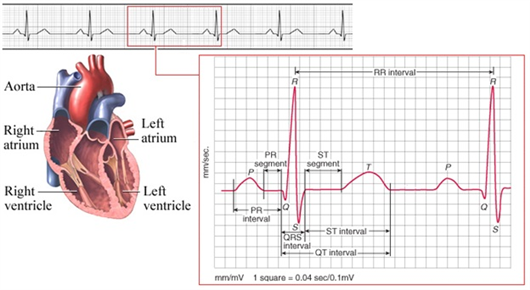

# [ECG Research](https://www.datasci.com/solutions/cardiovascular/ecg-research)

An electrocardiogram (**ECG** or **EKG**) is a measure of how the electrical activity of the heart changes over time as action potentials propagate throughout the heart during each cardiac cycle. As the heart beats, membrane polarity changes in the electrical conduction system throughout the heart result in the depolarization and repolarization of the atrial and ventricular cardiac cells, causing them to contract and relax.  

This contraction (depolarization) and relaxation (repolarization) can be measured using electrodes placed in different combinations and configurations on the chest and limbs to produce a series of ECG complexes. An ECG complex is comprised of different components, or waves, that represent the electrical activity in specific regions of the heart.  

---

## ECG Cycle Breakdown  

- **P Wave** – represents the movement of an electrical wave originating at the sinoatrial (SA) node and resulting in depolarization of the left and right atria.  
- **P-R Segment** – the pause in electrical activity caused by a delay in conduction of the electrical current at the atrioventricular (AV) node to allow blood to flow from the atria to the ventricles before ventricular contraction begins.  
- **P-R Interval** – the time between the beginning of atrial depolarization and the beginning of ventricular depolarization. A change in the P-R interval is often an indicator of parasympathetic nervous system influences on the heart.  
- **QRS Complex** – represents the electrical activity from the beginning of the Q wave to the end of the S wave; this corresponds to the complete depolarization of the ventricles, which leads to ventricular contraction and ejection of blood into the aorta and pulmonary arteries.  
- **S-T Segment** – the pause in electrical activity after the ventricles’ depolarization to allow blood to flow out of the ventricles before ventricular relaxation begins.  
- **S-T Interval** – the time between the end of ventricular depolarization (end of S wave) and the end of repolarization (end of T wave).  
- **Q-T Interval** – the time between the beginning of ventricular depolarization (Q wave) and the end of repolarization (T wave).  
- **T Wave** – represents the repolarization of the ventricles.  

> **Note:** The repolarization of the atrial chambers is typically obscured by the ventricular depolarization and thus is not explicitly visible in the ECG complex.

---

## ECG Solutions from DataSci  

DataSci offers a variety of solutions for acquiring and analyzing ECG endpoints in both restrained and freely moving animal models. These solutions are compatible with multiple data acquisition modalities: implantable telemetry, external telemetry, or hardwired methods.

### Key Offerings & Modalities  

1. **Implantable Telemetry**  
   - The *PhysioTel™*, *PhysioTel™ HD*, and *PhysioTel™ Digital* implants support ECG and blood pressure monitoring in conscious, freely moving animals.  
   - Implants are available in different sizes for various species (e.g. mice, rats, dogs, non-human primates).  
   - Some models support **multi-lead ECG**.  
   - Telemetry systems use accompanying hardware and software (e.g. Ponemah).  

2. **Jacketed External Telemetry (JET)**  
   - A non-invasive method using surface electrodes while allowing continuous ECG measurements.  
   - Useful in studies where implantable telemetry is not feasible (e.g. toxicology).  
   - Compatible with respiratory and blood pressure monitoring add-ons.  
   - Supports optional ECG PRO and Data Insights modules.

3. **Hardwired Instrumentation**  
   - Short duration ECG is collected via cables and external hardware while the subject is restrained.  
   - DataSci offers **Multi-Lead ECG Pods** (e.g. 10-lead patient cables, up to 12 leads) connected to acquisition systems using standard modules like the 7700 Chassis.  

### Lead Configurations & Recommendations  

- **Small Animal Models**: Typically use a single-lead (2 electrode) ECG setup. Modified lead II placement is recommended for clear signal morphology.  
- **Large Animal Models**: Similar lead guidance applies. In addition, DataSci offers **Solid Tip ECG lead** in large animals to reduce muscle noise and artifacts.  
- **Multi-Lead ECG**: Fully supported in **hardwired instrumentation** setups via ECG Pod systems.  

### Surgical & Procedural Support  

DataSci provides surgical support, guides, and videos for proper lead placement during implant procedures. Researchers can consult their **Surgical Services** for more detailed help.

---

## Bibliography & Publications  

DataSci maintains a **bibliography search tool** to find publications that have used DataSci’s ECG technology. Some representative references include:

- Sgoifo, A., et al., “Electrode positioning for reliable telemetry ECG recordings during social stress in unrestrained rats.” *(Physiology and Behavior, 1996)*  
- London, B., “Cardiac arrhythmias: From (transgenic) mice to men.” *(J Cardiovascular Electrophysiology, 2001)*  
- Holzgrefe, H., Cavero, I., et al., “Novel probabilistic method for precisely correcting the QT interval for heart rate in telemetered dogs and cynomolgus monkeys.”  
- Others across species for ECG and cardiovascular endpoints in freely moving models.  

---

## Images

---

## Call to Action  

For further details, or to request a quote or consultation, you can reach out via DataSci’s **Request More Information** or **Free Consultation** links.  
